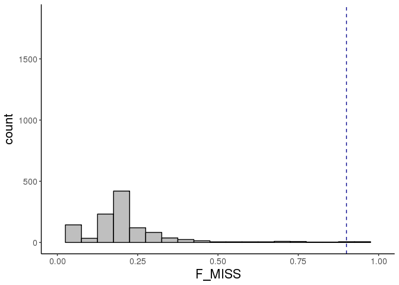
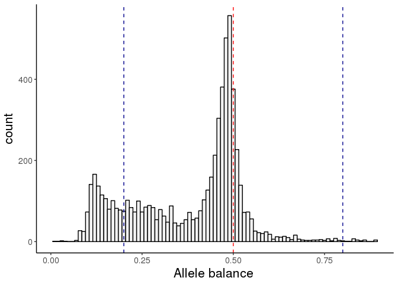
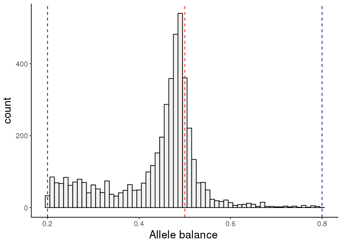
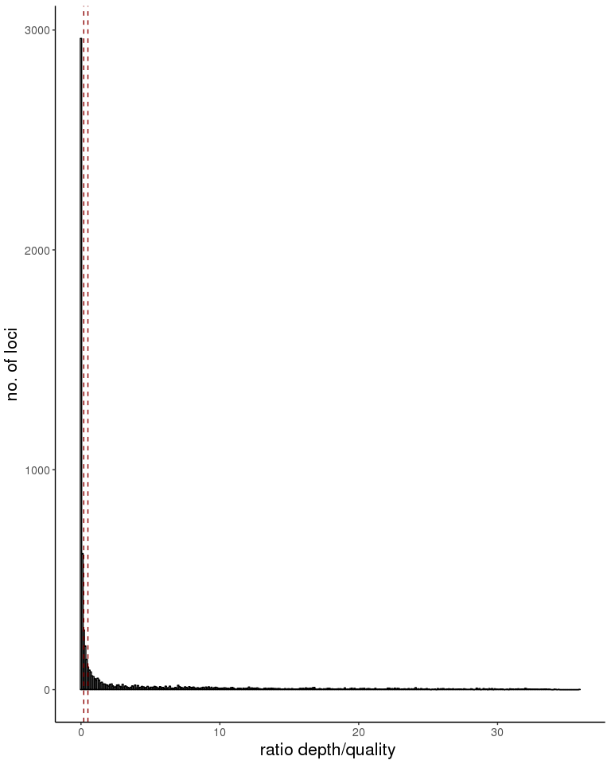
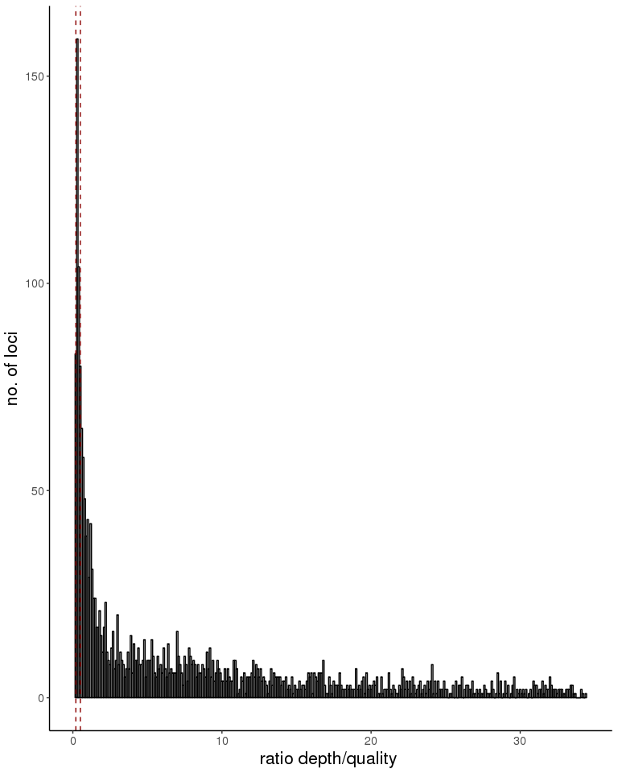
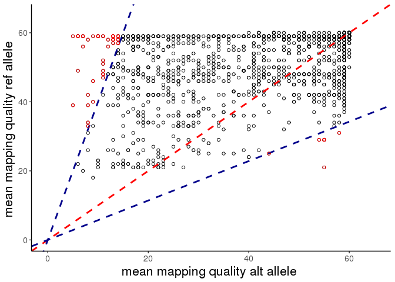
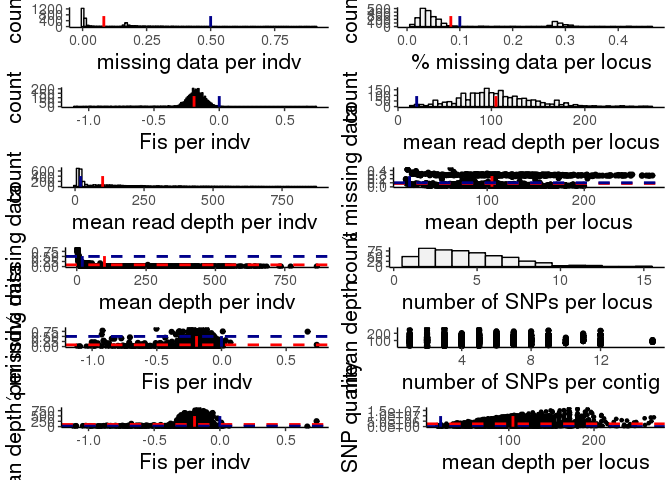
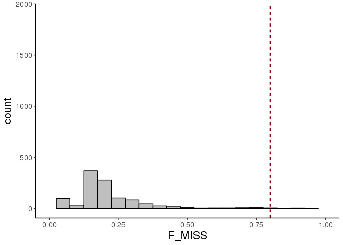
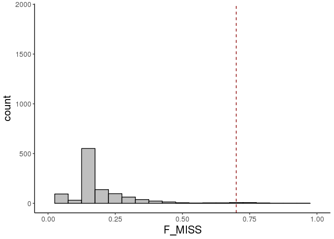

SNP FILTERING
================

This filtering scheme follows the FS6 scheme of SJO'Leary but stops the alternate paring of genotypes and missing individuals with missing data at the 70% / 70% step.

``` r
knitr::opts_chunk$set(
    echo = FALSE,
    message = FALSE,
    warning = FALSE
)
library(ggplot2)
library(readr)
library(dplyr)
library(here)
source(here("filtering", "ggplot.R"))
source(here("filtering", "VCFfilterstats.R"))
source(here("filtering", "xtrafunctions.R"))
```

Filtering to yield more loci than FS6
-------------------------------------

### Step 1: Filter LQ loci

Remove SNPs with quality score &lt; 20, minimum depth per genotype &lt; 5, minimum mean depth &lt; 15.
This chunk can take some time because it is filtering out the full data set. Adding maf 0.2 here results in ~1000 SNPs, trying to add it later.

### Step 2: Missing data indvidiuals/loci

The max-missing option excludes sites based on the proportion of missing data where 0 is completely missing and 1 is not missing at all.

#### 2a: Retain loci with genotype call rate &gt; 50% and flag individuals with missing data.

#### 2b: Identify individuals with &gt; 90% missing data.

Everything to the right of the blue line will be eliminated.



Remove flagged individuals, adding maf 0.2 here results in 0 SNPs, trying later.

### Step 3: Info flag filtering

#### Allele balance

AB: Allele balance at heterozygous sites: a number between 0 and 1 representing the ratio of reads showing the reference allele to all reads, considering only reads from individuals called as heterozygous

Allele balance is the ratio of reads for reference allele to all reads, considering only reads from individuals called as heterozygous. Values range from 0 - 1; allele balance (for real loci) should be approx. 0.5. Filter contigs SNPs for which the with allele balance &lt; 0.25 and &gt; 0.75.



Filter contigs with SNP calls with AB &gt; 0.2, AB &gt; 0.8; retain loci very close to 0 (retain loci that are fixed variants). Remove genotypes if the quality sum of the reference or alternate allele was 0.

#### replot to make sure the changes were effective



#### Quality/depth ratio

Compare quality/depth.



Remove loci with quality/depth ratio &lt; 0.2

 Based on the above graph, I was going to re-do the cutoff at 0.5 but the y-axis shows that the peak went down from 3000 to 150 so even though there is still a peak, it is clearly very zoomed in.

#### ratio mapping quality

Remove loci based on ratio of mapping quality for reference and alternate allele, i.e. sites that have a high discrepancy between the mapping qualities of two alleles. Skipping this step because vcf tools takes more than the red circles.



Filter loci with mapping quality ratio &lt; 0.25 and &gt; 1.75.

<!-- ```{bash include=FALSE} -->
<!--  -->
<!-- vcffilter -s -f "MQM / MQMR > 0.25 & MQM / MQMR < 1.75" results/step3ABQDPTH.recode.vcf > results/step3ABQDPTHMQM.recode.vcf -->
<!-- mawk '!/#/' results/step3ABQDPTHMQM.recode.vcf | wc -l -->
<!-- echo $? -->
<!-- # mapping quality -->
<!-- cut -f8 results/step3ABQDPTH.recode.vcf | grep -oe "MQM=[0-9]*" | sed -s 's/MQM=//g' > results/step3ABQDPTH.MQM -->
<!-- cut -f8 results/step3ABQDPTH.recode.vcf | grep -oe "MQMR=[0-9]*" | sed -s 's/MQMR=//g' > results/step3ABQDPTH.MQMR -->
<!-- ``` -->
`{r eval=FALSE} #  # temp <- read.table(here("filtering","results", "step3ABQDPTH.MQM"), col.names = "MQM") #  # mapqual <- read.table(here("filtering","results", "step3ABQDPTH.MQMR"), col.names = "MQMR") #  # mapqual <- bind_cols(mapqual, temp) %>% #   mutate(ratio = MQM/MQMR) #  # filter <- mapqual %>% #   filter(ratio < 0.25 | ratio > 1.75) #  # ggplot(mapqual, aes(x = MQM, y = MQMR)) + #   geom_point(shape = 1) +  #   geom_abline(intercept = 0, slope = 1, size = 1, color = "red", linetype = "dashed") + #   geom_abline(intercept = 0, slope = 4, size = 1, color = "darkblue", linetype = "dashed") + #   geom_abline(intercept = 0, slope = 0.571, size = 1, color = "darkblue", linetype = "dashed") + #   geom_point(data = filter, aes(x = MQM, y = MQMR), shape = 1, color = "red") + #   scale_x_continuous(limits = c(0, 65)) +  #   scale_y_continuous(limits = c(0, 65)) + #   labs(x = "mean mapping quality alt allele ", y = "mean mapping quality ref allele ") + #   theme_standard #  #`
================================================================================================================================================================================================================================================================================================================================================================================================================================================================================================================================================================================================================================================================================================================================================================================================================================================================================================================================================================================================================================

It seems like this is cutting out a lot more loci than the red ones in the first graph. I'm not sure the vcffilter is doing what it thinks it is. Undo the cut of loci.

#### Maximum depth & Quality

Identify distribution of depth (based on original data set) to identify loci with excess coverage.

(INFO flags in filtered data set are are based on original number of individuals in data set).

Calculate average depth and standard deviation:


<!-- Mean depth per locus (across all indivuals) is 3.209695\times 10^{5} and the standard deviation is 1.4583324\times 10^{5}.  -->
<!-- Filter SNP site with depth > mean depth + 1 standard deviation = 6.1263599\times 10^{5} and that have quality scores < 2x the depth at that site and output depth per site. -->
Compare the distribution of mean depth per site averaged across individuals to determine cut-off value of sites with excessively high depth indicative of paralogs/multicopy loci.


Choose cut-off for maximum mean read depth = 200 (calculate mean + 2x std: 199.7987565)

#### Plot stats after FIL\_6 filters



### Step 4: Filter Missing data loci/indv

Remove loci with genotype call rate &lt; 60%.

Identify individuals with &gt; 80% missing data



Remove flagged individuals

Step 5
------

Remove loci with genotype call rate &lt; 70%.

Identify individuals with &gt; 70% missing data



Remove flagged individuals

Final FIL\_6 filtering step, remove indels and apply maf of 0.2

### Plot stats for filtered data set


Data set contains 2979 individuals and 1004 loci.

Run SNP counting script
-----------------------

Compare SNPs/contigs/indv at each filtering step and between filtering schemes.

| FILTER SNP CONTIG INDV                        |
|:----------------------------------------------|
| step1.recode.vcf step1 6739 534 3153          |
| step2a.recode.vcf step2a 6736 534 3153        |
| step2b.recode.vcf step2b 6736 534 3005        |
| FIL\_6.recode.vcf FIL\_6\_early 2269 514 3005 |
| step4a.recode.vcf step4a 2264 512 3005        |
| step4b.recode.vcf step4b 2264 512 2999        |
| step5a.recode.vcf step5a 2186 510 2999        |
| step5b.recode.vcf step5b 2186 510 2979        |
| FIL\_6.recode.vcf FIL\_6\_later 1004 484 2979 |

Convert the vcf to a genepop
